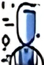
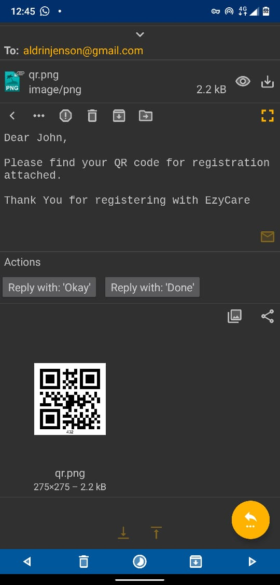
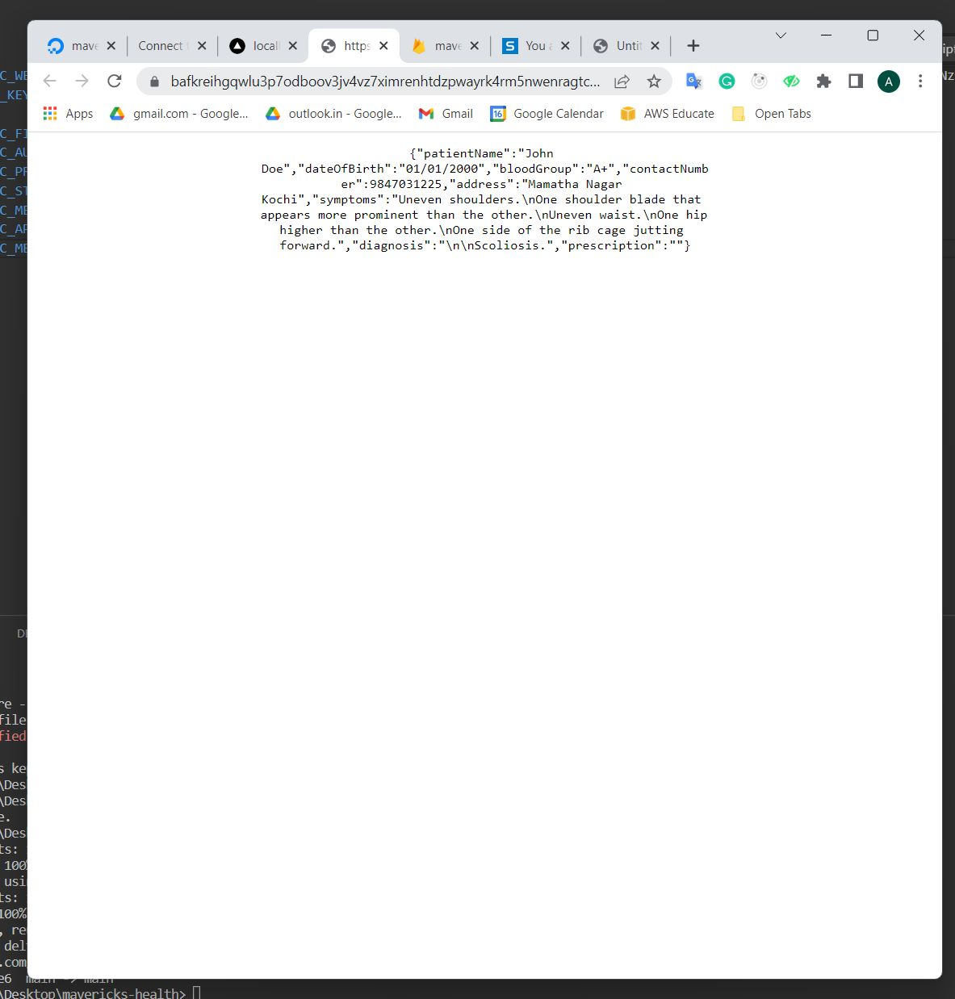
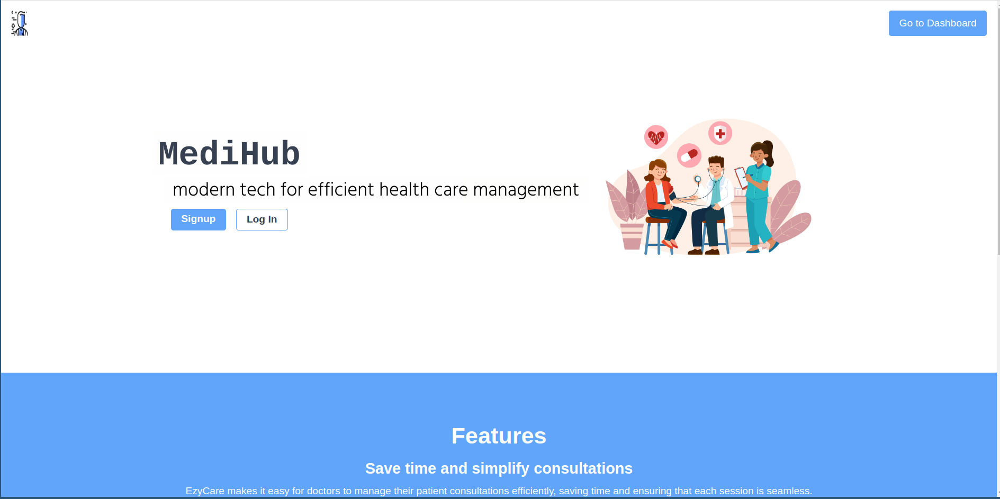
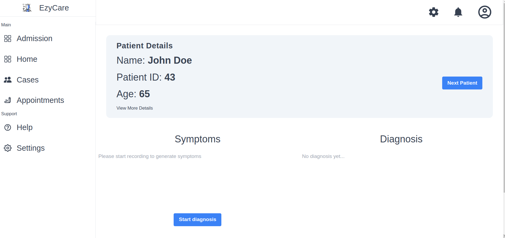
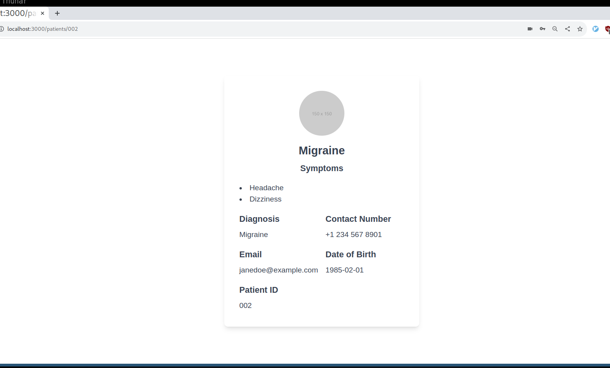
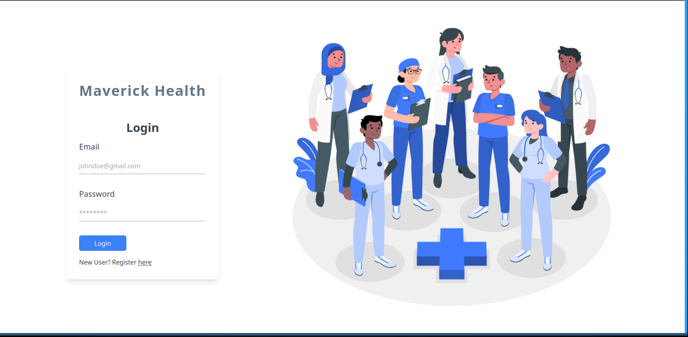

 
  

<h1 align="center"> 
    MediHub 
</h1>
<h3 align="center"> 
    Streamlining Healthcare Management with Cutting-Edge Technology 
</h3>

 

## Table of Contents 

- [Overview](#overview)
  - [Key Features](#key-features)
  - [Technology Stack](#technology-stack)
- [Problem Statement](#problem-statement)
- [Installation Guide](#installation-guide)
- [Contributing](#contributing)

## Overview 

Welcome to MediHub, a comprehensive healthcare management solution designed to revolutionize the way clinics and hospitals operate. By leveraging advanced technologies, MediHub provides a seamless and efficient platform for managing patient consultations, medical records, and clinic workflows.

### Key Features 

- **Patient Management**: Simplify patient registrations and appointments with QR code scanning and image-based data entry.
- **Record Security**: Utilize decentralized blockchain technology for secure and private storage of medical records.
- **AI Diagnostics**: Implement artificial intelligence for accurate and prompt diagnosis suggestions.
- **Speech Recognition**: Enhance documentation efficiency with speech-to-text capabilities.
- **Communication Tools**: Integrated email and SMS notifications for first-time and returning patients.
- **Report Generation**: Enable patients to access and generate PDF reports of their diagnoses and consultations.

### Technology Stack 

- Blockchain (FileCoin, IPFS, Web3Storage)
- Cloud Services (DigitalOcean)
- Frontend (NextJS, TailwindCSS)
- Backend (Firebase, Flask, NodeMailer)

[ <a href="#table-of-contents">↑ Back to top ↑</a> ]

## Problem Statement 

MediHub addresses critical challenges faced in the healthcare industry, including time-consuming patient visits, inefficient record keeping, and the risk of misdiagnosis. By implementing cutting-edge technologies, MediHub offers a solution that enhances the overall healthcare experience for both patients and medical professionals.

[ <a href="#table-of-contents">↑ Back to top ↑</a> ]

## Installation Guide 

   
Linux

   Instructions for Linux installation...

 

   
MacOS

   Instructions for MacOS installation...

 

   
Windows

   Instructions for Windows installation...

[ <a href="#table-of-contents">↑ Back to top ↑</a> ]

## Contributing 

We welcome contributions from the community! If you're interested in helping improve MediHub, please see our contribution guidelines for more information.

[ <a href="#table-of-contents">↑ Back to top ↑</a> ]

## Screenshots

| Mail Notification  | Blockchain Integration | Landing Page |
|--------------------|------------------------|--------------|
|  |  |  |

| Dashboard | Patient Profile | Detailed View |
|-----------|-----------------|---------------|
|  |  |  |

